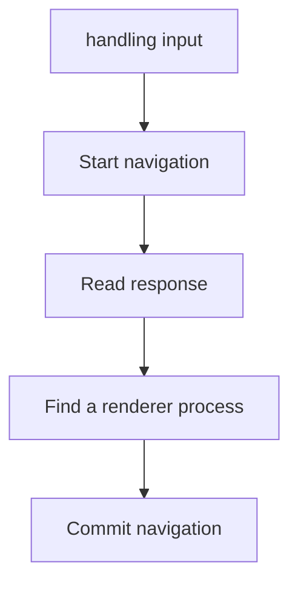
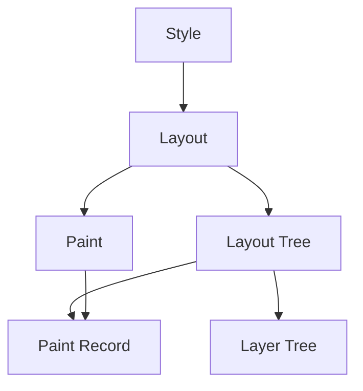

# Inside look at modern web browser

## [Part 1: CPU, GPU, Memory, and multi-process architecture](https://developers.google.com/web/updates/2018/09/inside-browser-part1)
  - Usually, applications run on the CPU and GPU using mechanisms provided by the Operating System. (computer architecture)

     

- A **process** can be described as an application’s executing program. A **thread** is the one that lives inside of process and executes any part of its process's program.
- When you start an application, a process is created.
  - The Operating System gives the process a "slab" of memory to work with and all application state is kept in that private memory space. When you close the application, the process also goes away and the Operating System frees up the memory.
- If two processes need to talk, they can do so by using Inter Process Communication (IPC).

### Browser architecture
- it could be one process with many different threads or many different processes with a few threads communicating over IPC.
  - these different architectures are implementation details. There is no standard specification on how one might build a web browser.

    

- Chrome's architecture

  

  - click the options menu icon more_vert at the top right corner, select More Tools, then select Task Manager. This opens up a window with a list of processes that are currently running and how much CPU/Memory they are using.

### Which process controls what

### The benefit of multi-process architecture in Chrome
- If one tab becomes unresponsive, then you can close the unresponsive tab and move on while keeping other tabs alive
- Another benefit of separating the browser's work into multiple processes is security and sandboxing.

### Per-frame renderer processes - Site Isolation
- [Site Isolation](https://developers.google.com/web/updates/2018/07/site-isolation) is a recently introduced feature in Chrome that runs a separate renderer process for each cross-site iframe.
  - Site Isolation isn’t as simple as assigning different renderer processes; it fundamentally changes the way iframes talk to each other. Opening devtools on a page with iframes running on different processes means devtools had to implement behind-the-scenes work to make it appear seamless
  
    

## [Part 2: What happens in navigation](https://developer.chrome.com/blog/inside-browser-part2/)

### A simple navitagion

### Navigate to a different site

### In case of service worker

### Navigation preload

## [Part 3: Inner workings of a Renderer Process](https://developers.google.com/web/updates/2018/09/inside-browser-part3)

### Parsing
- When the renderer process receives a commit message for a navigation and starts to receive HTML data, the main thread begins to parse the text string (HTML) and turn it into a **Document Object Model (DOM)**.
    - The DOM is a browser's internal representation of the page as well as the data structure and API that web developer can interact with via JavaScript.
- Parsing an HTML document into a DOM is defined by the HTML Standard. 

- The main thread parses CSS and determines the computed style for each DOM node. This is information about what kind of style is applied to each element based on CSS selectors. 

    

- The layout is a process to find the geometry of elements. The main thread walks through the DOM and computed styles and creates the layout tree which has information like x y coordinates and bounding box sizes.

    

- Paint record is a note of painting process like "background first, then text, then rectangle".

    

- In order to find out which elements need to be in which layers, the main thread walks through the layout tree to create the layer tree (this part is called "Update Layer Tree" in the DevTools performance panel).

    

## [Part 4: Input is coming to the compositor](https://developers.google.com/web/updates/2018/09/inside-browser-part4)

- Since running JavaScript is the main thread's job, when a page is composited, the compositor thread marks a region of the page that has event handlers attached as **"Non-Fast Scrollable Region"**. 
    - By having this information, the compositor thread can make sure to send input event to the main thread if the event occurs in that region. If input event comes from outside of this region, then the compositor thread carries on compositing new frame without waiting for the main thread.

- A common event handling pattern in web development is **event delegation**. Since events bubble, you can attach one event handler at the topmost element and delegate tasks based on event target. 